# J2TEAM CTF Writeups part 1:
###### *10/24/2020*

___
Chào các bạn =))))
Những ngày vừa rồi các bạn đã tham gia J2TEAM CTF chưa??? có khúc mắc gì không nàooo?? Nếu có thì ngồi xuống và xem Writeup của chúng mình để được khai sang ngay nhé :3

BẮT ĐẦU NÀOOO!!!!!
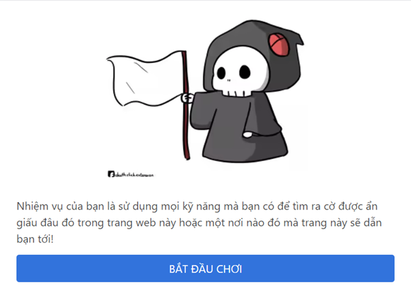
###### giao diện khởi động J2TEAM CTF

## Nhiệm vụ 1:
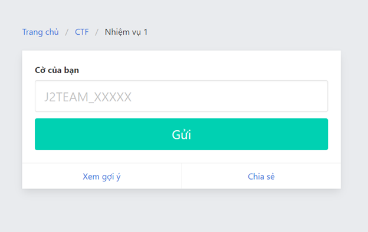

Nhìn chung thì J2TEAM CTF 2020 là 1 web challenge nên việc cơ bản nhất bạn cần làm đó là View page source (phím tắt Ctrl + U). Sau đó bạn dẫn đến 1 tab khác và hiển thị đầu tiên đó là flag của chúng ta:

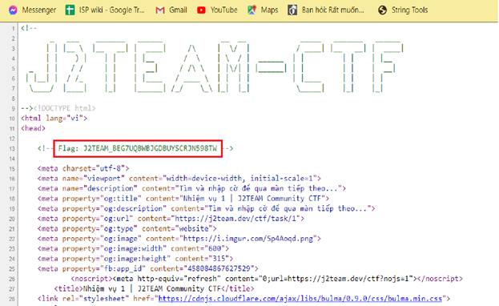

Rồi sau đó bạn copy flag và nhấn “Gửi” là xong Nhiệm vụ 1 rồi. Sang Nhiệm vụ 2 luôn nào.

## Nhiệm vụ 2:
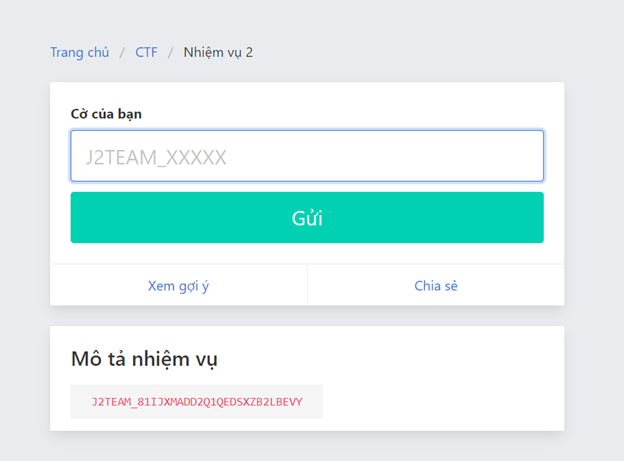

Các bạn có thể thấy phần mô tả ở dưới có dạng giống flag, tuy nhiên vấn đề ở đây là bạn lại không copy được. Từ đó, bạn có thể có 2 cách:
* Bạn có thể copy tùng từ 1 lên trên :> (Khá là thủ công)
* Bạn sẽ View page source rồi kéo đến phần code của “Mô tả nhiệm vụ”

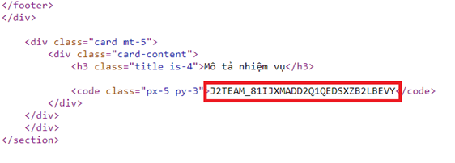

Bây giờ bạn có thể copy được rồi đó :> Submit để qua Nhiệm vụ tiếp theo nào.

## Nhiệm vụ 3:
Nhiệm vụ lần này sẽ khá giống Nhiệm vụ 2, nhưng khi bạn copy thì chỉ hiện lên chữ “J2TEAM” như trong hình và không có các kí tự tiếp theo.

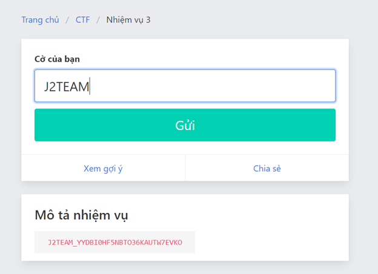

Đến lúc này bạn sẽ phải kiểm tra ở chỗ code có "**Cờ của bạn**". Và như ở code ở đây, t thấy dãy kí tự nhập vào chỉ có thể nhập vào 6 kí tự.

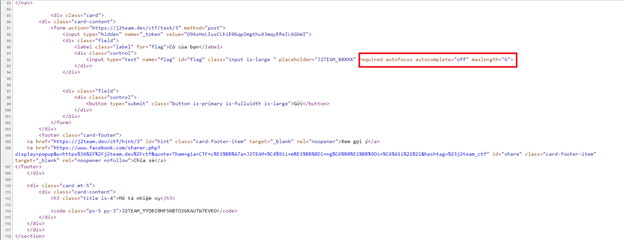

Vậy nên bây giờ chúng ta sẽ bỏ điều kiện đó đi để có thể nhập lại bình thường.
Lúc này bạn sẽ làm các bước sau: Chuột phải -> Inspect -> Elements -> Tìm chỗ nhập flag -> Xóa bỏ yêu cầu độ dài (`maxlength="6"`) để có thể nhập lại bình thường.
Các bạn double click vào đoạn code để sửa nhé.

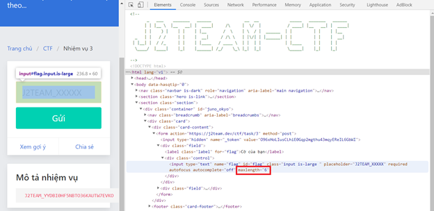

Và bây giờ thì các bạn có thể quay lại và nhập vào như bình thường được rồi =))))) DONE!!!!!!

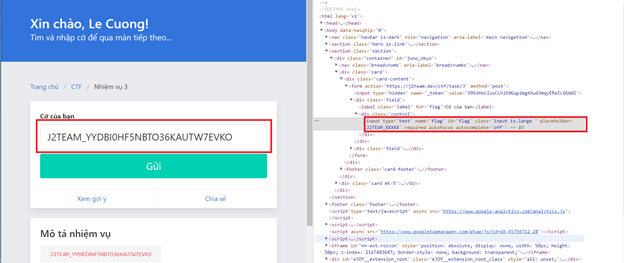

## Nhiệm vụ 4:
Lại có gợi ý. Có j mình cứ sẽ thử submit nhé?

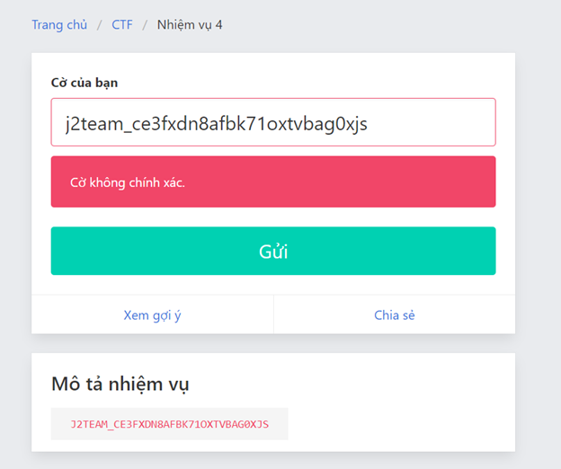

Khi các bạn copy flag vào chỗ nhập flag, các bạn sẽ để ý thấy flag đầu tiên sẽ hiển thi dưới dạng chữ IN HOA như sau đó lại trở về các chữ in thường.

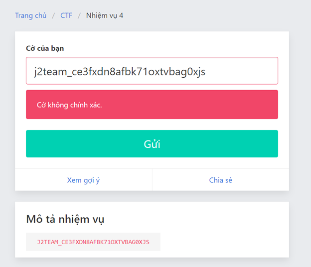

Vậy nên chúng ta sẽ khắc phục để sao cho khi copy flag sẽ hiển thị dạng IN HOA nhé.

Sau khi bạn Inspect -> Elements thì bạn sẽ check phần code nhập flag `</script>`

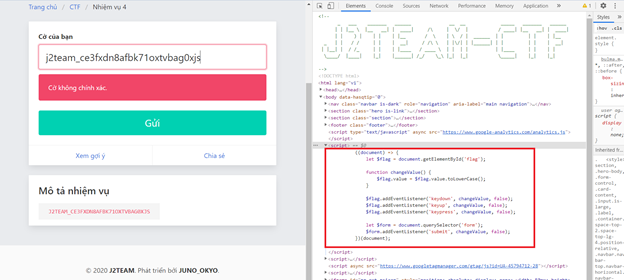

Sau đó bạn thấy vấn đề ở đây đó chính là function này:

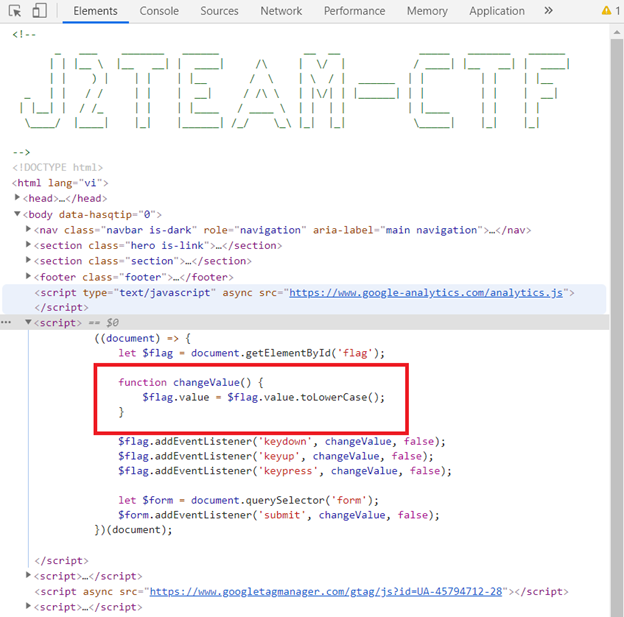

Bây giờ chúng ta sẽ sửa method thành `.toUpperCase()` có chức năng IN HOA như sau:

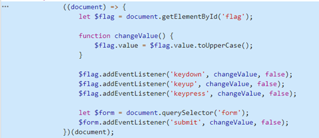

Tiếp đến, chúng ta sẽ copy đoạn code này rồi vào console (1) và paste vào (2) rồi Enter. Và cuối cùng (3) chính là thành quả :3

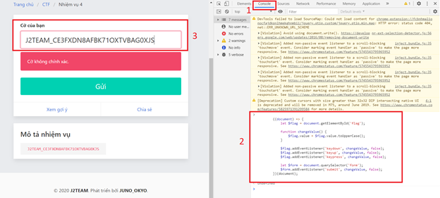

## Nhiệm vụ 5:
Sau khi bạn sub thử flag ở phần Mô tả nhiệm vụ thì nó sẽ hiện lên 1 dòng chữ “Please enter a URL” như hình.

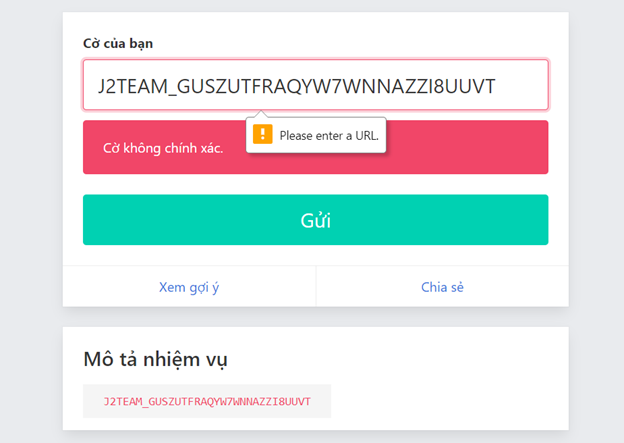

Vì flag chỉ ở dạng text nên là mình sẽ phải sửa lại kiểu dữ liệu nhập vào (từ URL thành text) thì mới có thể submit được flag.

Inspect nàooooo!
Bạn sẽ tìm đoạn code ở phần nhập flag. Sau đó bạn sẽ thay đổi type (kiểu dữ liệu) từ “url” thành “text” như trong hình dưới.

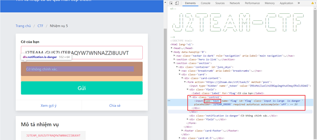

Bây giờ việc còn lại sẽ chỉ là copy lại flag và paste để submit thui nhé ^^

## Nhiệm vụ 6:
Mô tả: “Nó đang ở ngay trước mắt bạn”. Hmmm, nếu không nhìn thấy gì thì mình cứ nhìn qua Ctrl + U nhé =))))))

Khi kéo đến phần Mô tả nhiệm vụ, bạn sẽ thấy được flag. Lý do ở đây đó chính là họ đã chỉnh màu chứ flag trùng với màu nền nên không thấy được.

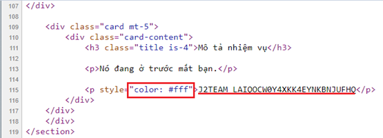

Tuy nhiên nếu bạn dung chuột tô phần khoảng trống dưới phần mô tả, flag cũng sẽ hiện ra nhé :3

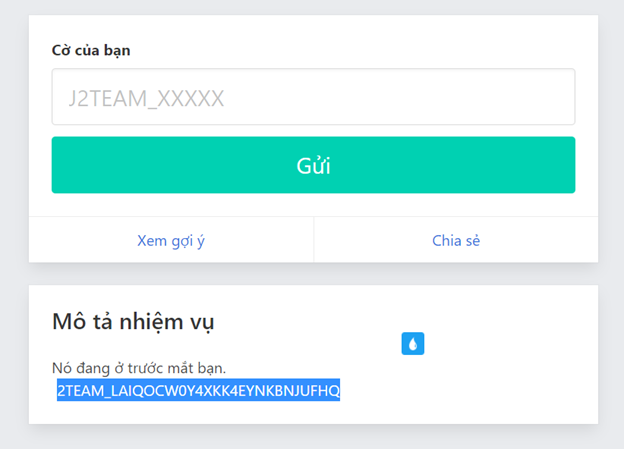

## Nhiệm vụ 7:
Các bạn cứ xem hết vid này nhé bởi vid sẽ không có flag đâu =))))
Thay vào đó, các bạn sẽ xem vid này trên Youtube và kiểm tra phần Describe (Mô tả) của vid đó để kiểm tra nhé.

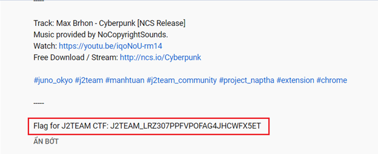

Submit ngay thôi 🙂

## Nhiệm vụ 8:
Không mô tả gì thì mình cứ Ctrl + U thôi :>
Chưa gì đã thấy flag rồi kìa.


Ơ mà sao lại không submit được thế? :< Thử Inspect vậy.

*HÓA RA ĐÂY CHÍNH LÀ THỦ PHẠM.*

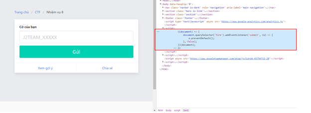

Đoạn `</script>` này đã chặn việc submit của chúng ta. Bây giờ chúng ta sẽ sửa nó.

Bạn chuyển sang console (1) và copy dòng dưới vào (2) rồi Enter.

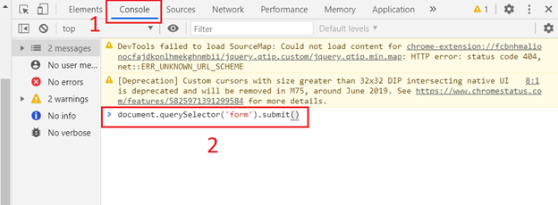

Bây giờ thì bạn submit như bình thường được rồi nhé.

## Nhiệm vụ 9:
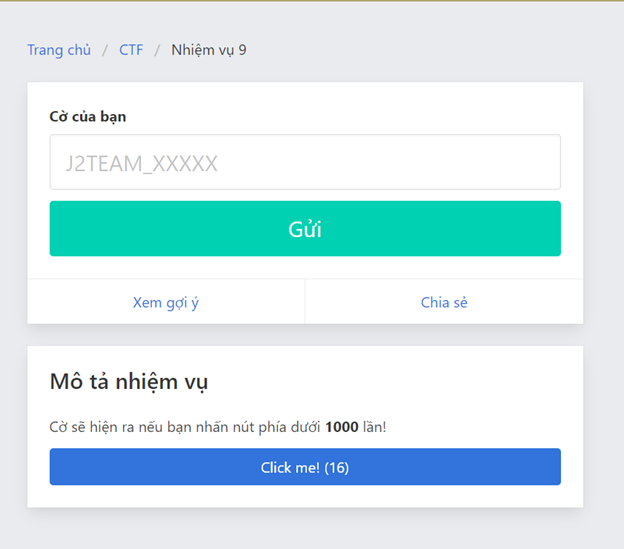

Nhiệm vụ này thì bạn có thể Click 1000 lần để có được flag hoặc là bạn Ctrl + U để kiểm tra nhé :>
Vậy là kết quả chúng ta có được là flag:

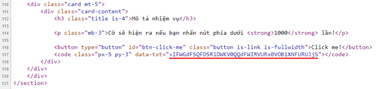

```javascript
=IFWGdFSQFDSRlDWKV0QQdFWIRVURx0VOB1XNFURUJjS
```
Tuy nhiên đây sẽ chưa phải là flag đúng do chưa có form J2TEAM. Mình để ý thấy kí hiệu “=” ở flag thì mình sẽ nghĩ đến ngay base64. Còn 1 điều nữa là sau khi encode `base64` thì đáng lẽ kí hiệu “=” sẽ ở cuối dòng nên chúng ta sẽ thử đảo ngược lại flag nhé.

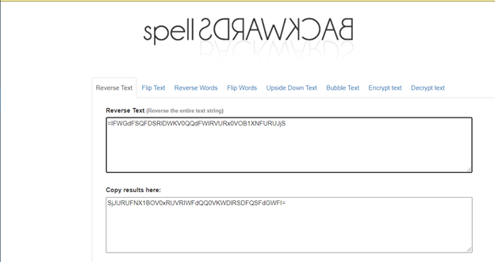

Ta được flag mới và cuối cùng là chuyển từ Base64 sang dạng ASCII nhé.

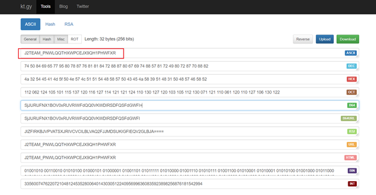

## Nhiệm vụ 10:
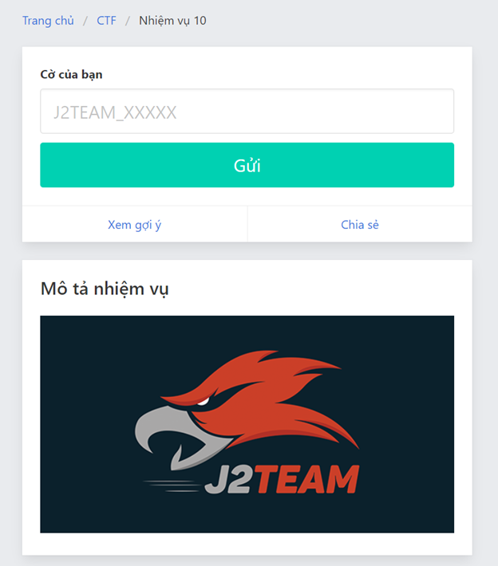

Ta thấy cái ảnh nên các bạn cứ thử Ctrl + U hoặc Inspect nhé 🙂

Sau khi Inspect ở  và tìm đến đoạn code chỗ bức ảnh thì mình đã thấy flag rồi nè :>

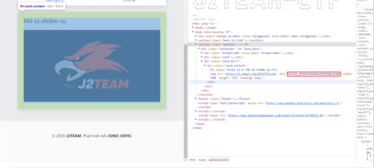

## Nhiệm vụ 11:
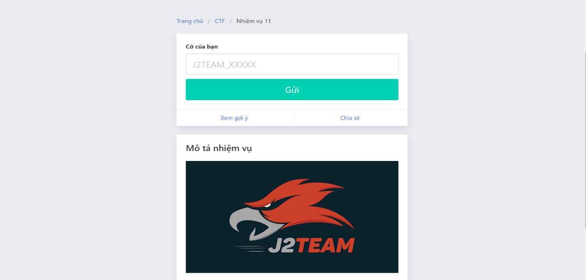

Nhìn qua thì Challenges 11 khá giống Challenges 10 nên chúng ta cũng F12 và Inspect bức ảnh này và ta được như sau:

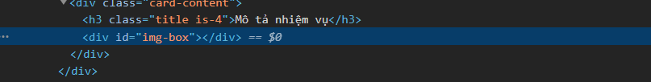
Chúng ta thấy 1 thẻ div có tên là ing-box, chúng ta tiếp tục Ctrl+F để tìm đến souce của thẻ này

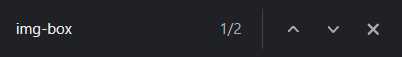

Và đây

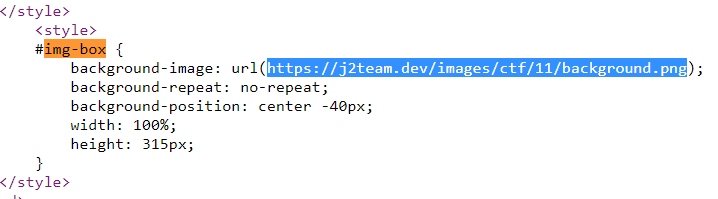

Chúng ta đã có link của bức hình này truy cập vào đây chúng ra sẽ có bức hình full như thế này

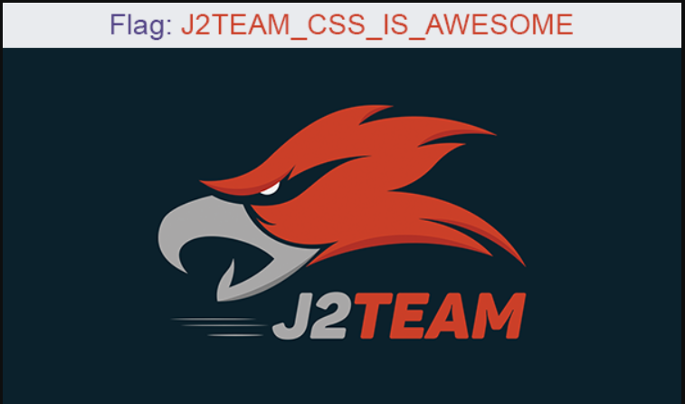

Yeah this is Flag.

## Nhiệm vụ 12:
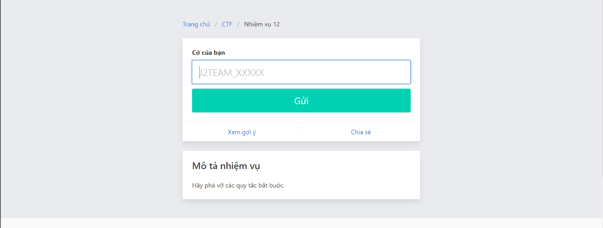

Mô tả nhiệm vụ cho chúng ta biết là "*Hãy phá vỡ các quy tắc bắt buộc*" , quy tắc của chơi CTF là phải submit Flag thì mới được qua. Vậy nên bài này chúng ta không cần nhập gì cả.

Nhưng mà nút gửi đã bị chặn bởi 1 thế lực thù địch nào đó =)). Chúng ta F12 và Inspect chỗ điền Flag ta sẽ được 1 thẻ div như sau:

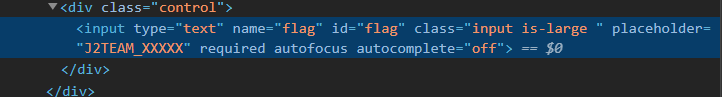

Ở đây có câu required vậy nên chúng ta chỉ việc xóa nó đi thoi!
Yeah like that, press Submit.

## Nhiệm vụ 13:
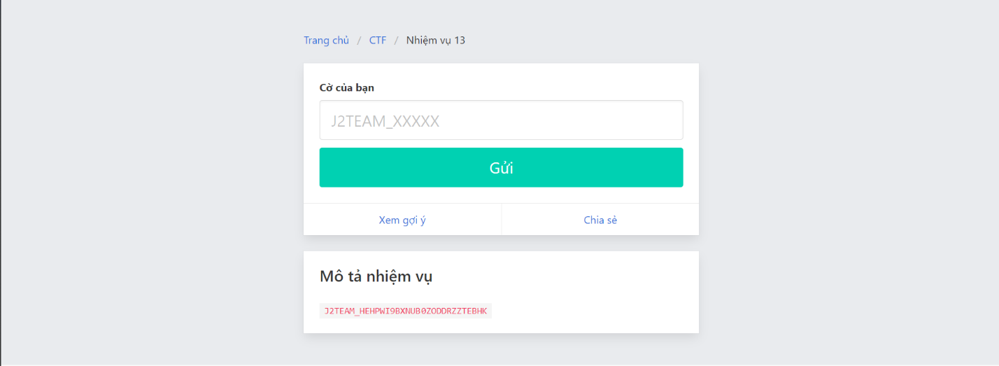

Ở đây chúng ta đã có sẵn Flag, nhưng bạn vẫn không Submit đúng.

Chúng ta lại Inspect Flag chúng ta sẽ được như sau:


Tên của thẻ này là “Kill the wolf” vậy chúng ta sẽ xóa đi thẻ span có class là Wolf.

Flag chuẩn sẽ là như thế này:

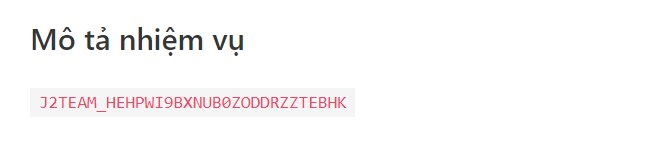

## Nhiệm vụ 14:
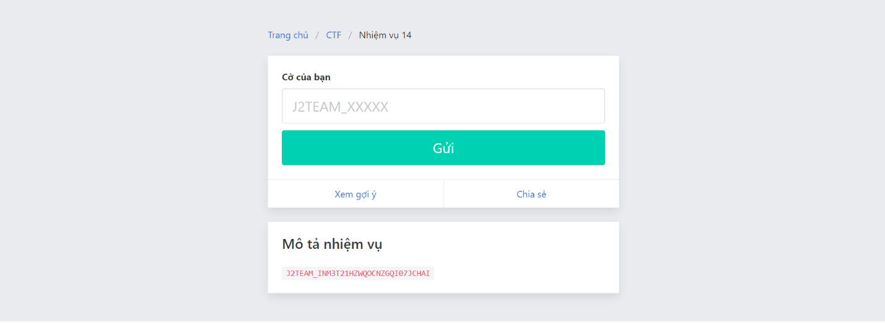

Từ challenges 13 chúng ta đã rút ra kinh nghiệm “Chỉ có làm thì mới có ăn” không bao giờ lại có Flag ngon ăn như thế này.
Nên chúng ta Inspect luôn

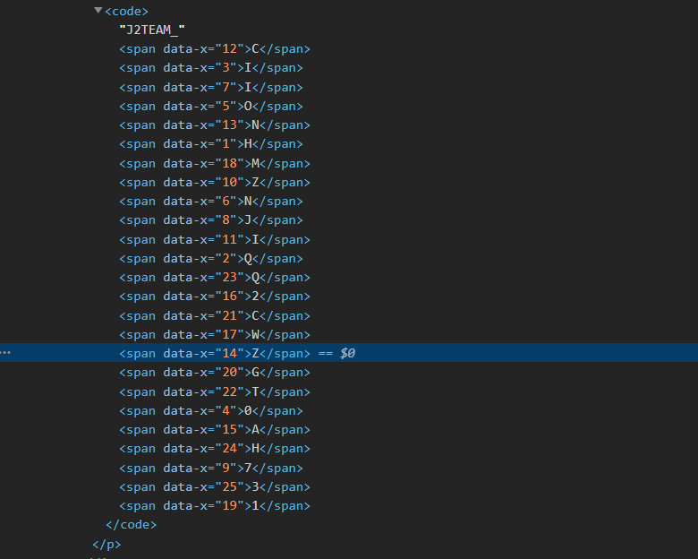

Ở đây chúng ta thấy rất nhiều thẻ và chúng có các số đi kèm và nó sẽ chính là số thứ tự của chúng, chúng ta chỉ cần sắp xếp lại thôi.


Và Flag chuẩn sẽ là:

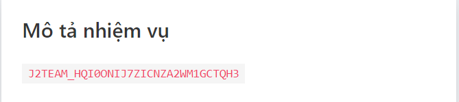

## Nhiệm vụ 15:
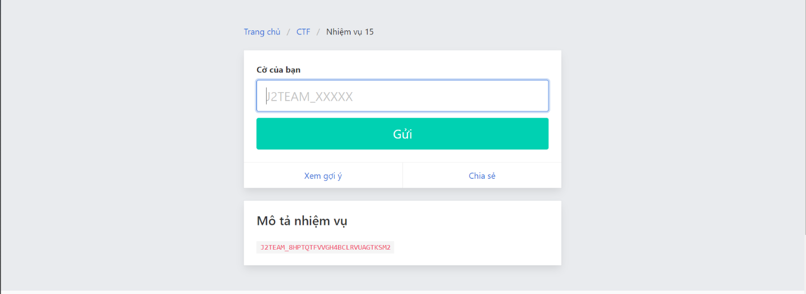

Vẫn như challenges 14 chúng ta làm tương tự:

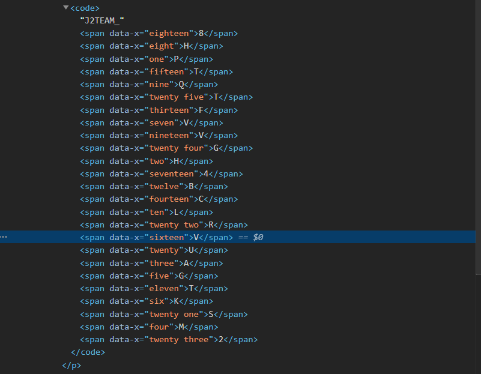

Sắp xếp lại chúng

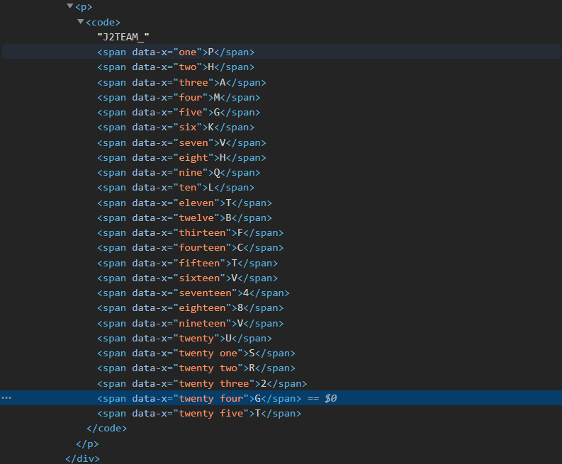

Result:

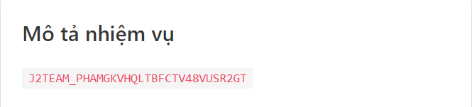

## Nhiệm vụ 16:
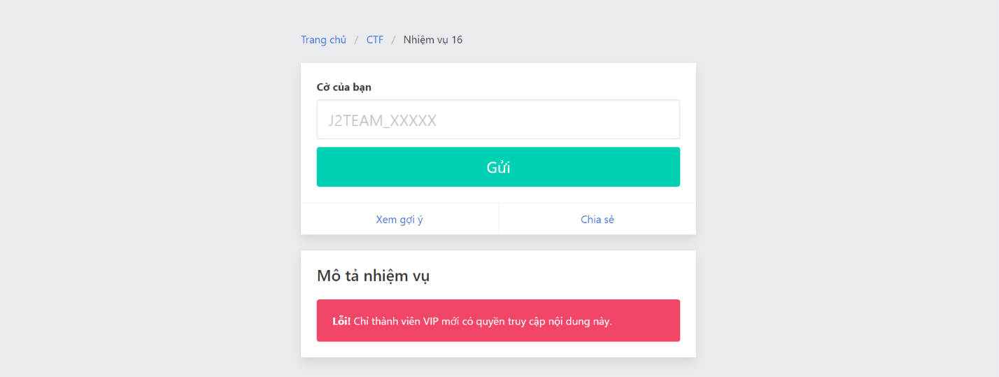

Mô tả nhiệm vụ cho chúng ta biết là phải là thành viên VIP mới có thể xem đc Flag

Nên chúng ta sẽ cần truy cập vào Cookies thường sẽ là nơi chứa dữ liệu về `member`.

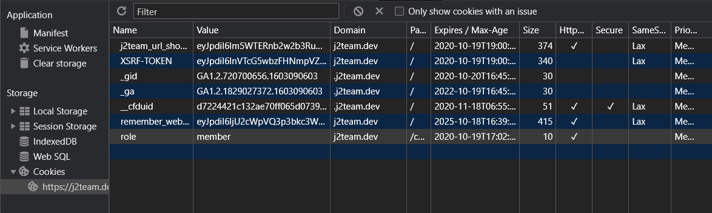

Ở đây chúng ta sẽ sửa lại mục role thành giá trị là `vip_member`

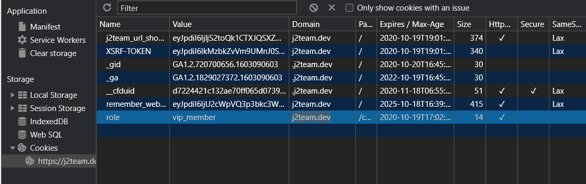

F5 lại trang là chúng ta có thể nhìn thấy Flag

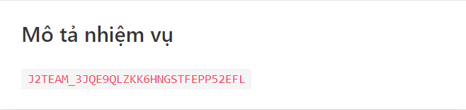

## Nhiệm vụ 17:
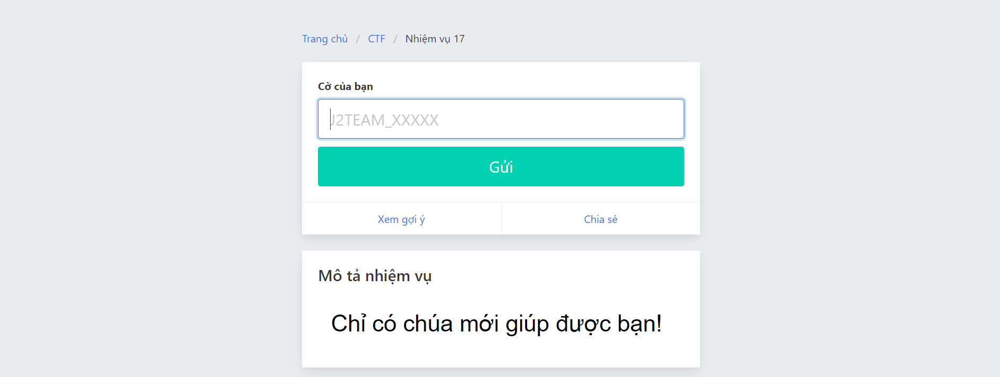

Tiếp tục Inspect mô tả nhiệm vụ ta sẽ được link của 1 trang web

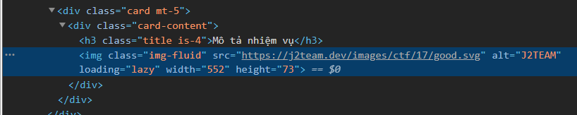

Truy cập vào nó ta sẽ thấy tên miền của nó có từ good khá là gần với từ god ta thử sửa nó lại xem.

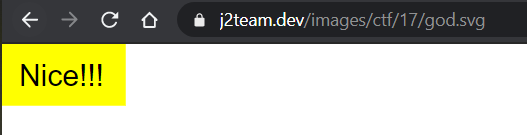

Wow, flag nè

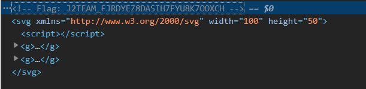

## Nhiệm vụ 18:
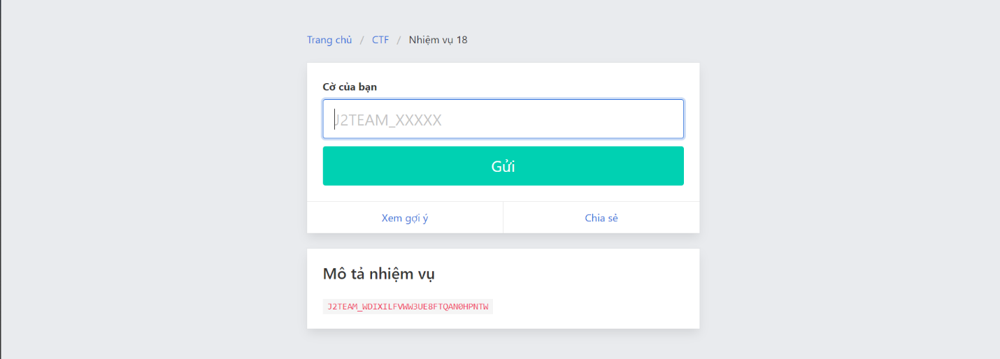

Flag ngay trc mặt chúng ta nhưng chúng ta bị mất con trỏ chuột =)))

Inspect ta sẽ được 1 thẻ đã xóa mất con trỏ của chúng ta

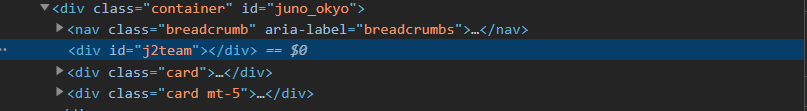

Xóa nó đi là okelaaa nhé.
Submit như bình thường thoiiii.

## Nhiệm vụ 19:
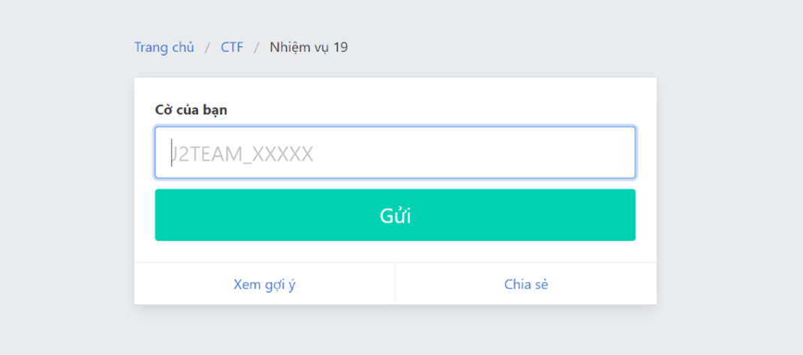

Không có mô tả nên chúng ta lại mò thôi F12 Và đây là 1 ví dụ rõ nhất cho việc không làm mà đòi có ăn =)))

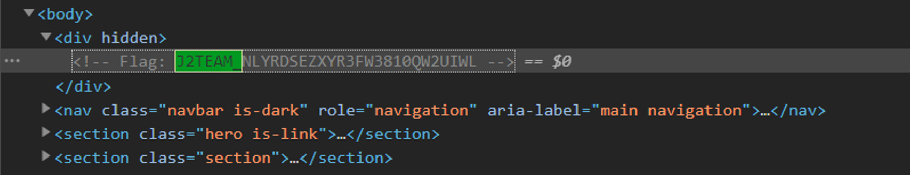

## Nhiệm vụ 20:
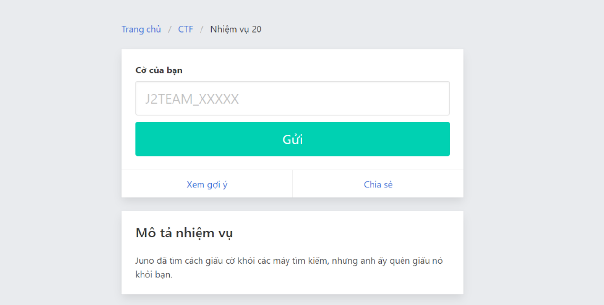

Ở phần mô tả nhiệm vụ cho chúng ta biết rằng Flag đã được giấu đi khỏi các máy tìm kiếm vậy chứng tỏ chúng ta sẽ không thể tìm chúng theo cách bình thường được. Chúng ta phải tìm ở trong file robots.txt
Bạn có thể tìm hiểu thêm [ở đây](https://support.google.com/webmasters/answer/6062596?hl=vi)

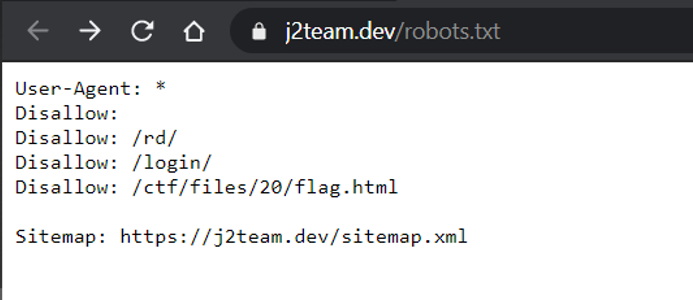

Sau đó chúng ta truy cập vào https://j2team.dev/robots.txt 

Ở đây chúng ta đã thấy dòng /ctf/files/20/flag.html tiếp tục truy cập vào https://j2team.dev/ctf/files/20/flag.html

Và chúng ta đã có flag :>

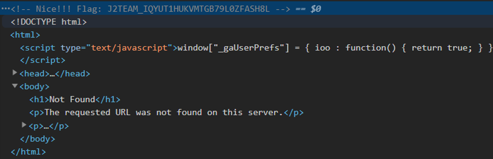

Hi vọng các bạn đã có thể có cho mình những lời giải đáp kĩ càng nhất 🙂

Hẹn gặp lại các bạn trong phần 2 nhé :>>>