# J2TEAM CTF Writeups part 2:
###### *10/27/2020*

___
Sau phần 1 được khá nhiều bạn đón nhận thì tiếp tục hôm nay mình sẽ lên phần 2 writeup lần này nhé :v

## Nhiệm vụ 21:
Mô tả nhiệm vụ t sẽ thấy 1 đoạn source code php, nhìn có vẻ để verify flag đó.

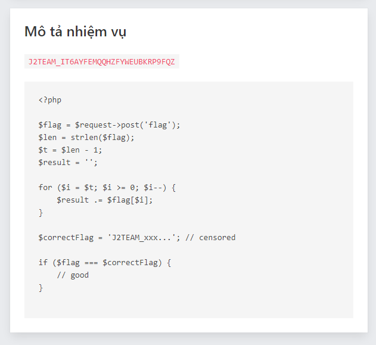

Nhìn ta sẽ phát hiện ra vòng lặp for được thực hiện để giảm đi tạo chuỗi mới đảo ngược với chuỗi ban đầu ở đây là flag. Vì vậy ta sẽ thu được flag mới là:

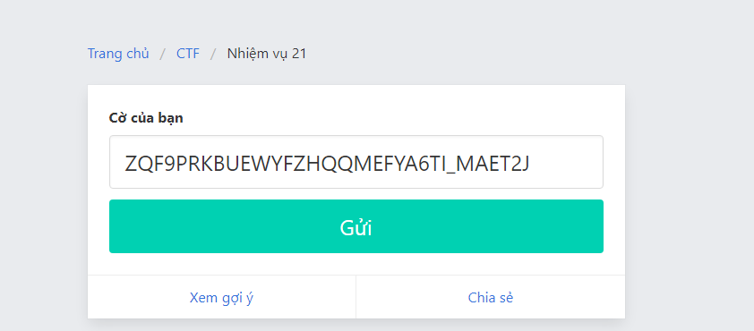

done :3

## Nhiệm vụ 23:
Hmm flag ngay trước mặt submit ngay thoi :v

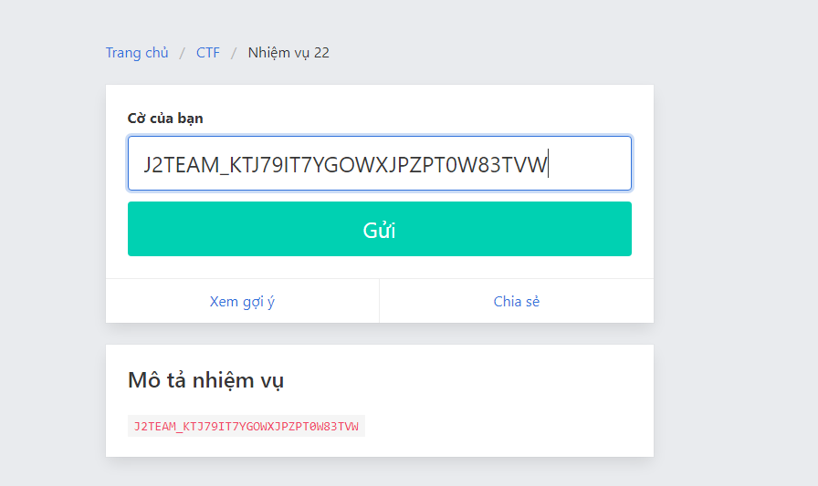

Có vẻ như không được:

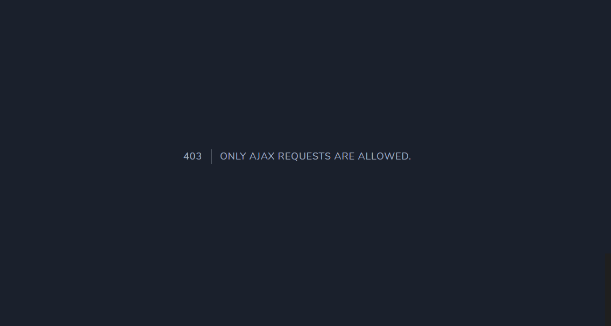

Sau một hồi search googe mình đã tìm ra đó là request submit flag chỉ có thểđược gửi bằng AJAX, thêm header: “X-Requested-With: XMLHttpRequest” vào và submit lại.

Done :3

## Nhiệm vụ 23:
Nhiệm vụ 23 này xem ra không có gì view-source thử thì để ý thấy:

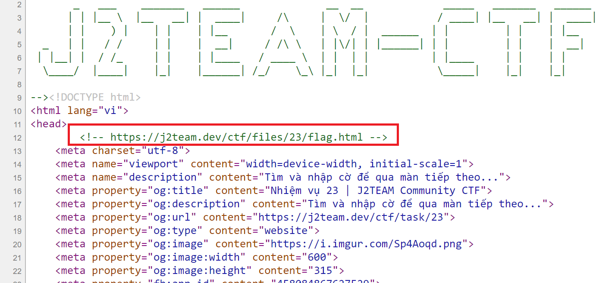

Khi truy cập vào url đó thì:

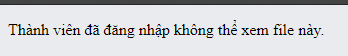

Oke :3 thế thì mình sẽ mở tab ẩn danh, oh yeah đã tìm thấy flag

## Nhiệm vụ 24:
Nhiệm vụ lần này mình hoàn toàn không thấy gì bất thường phải xem cả hmmm nó được giấu ở đâu nhỉ? Sau 1 hồi lần mò thì mình đã tìm thấy nó ở phần headers reponse của web challenge 24

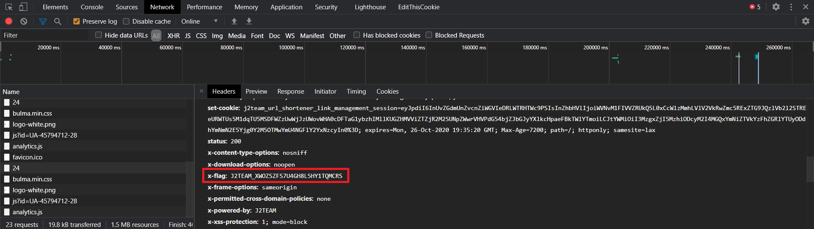

Nice :3 submit và done.

## Nhiệm vụ 25:
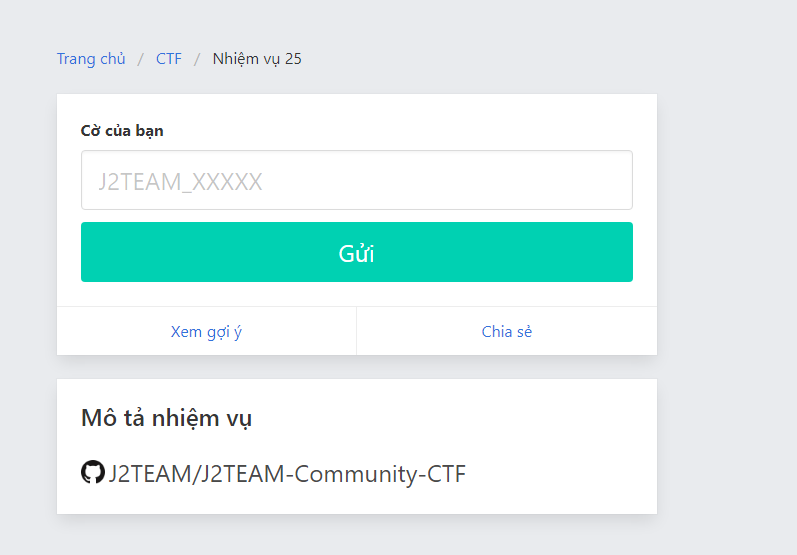

Hmm là 1 repository của github, hãy cùng kiểu tra nhé :3

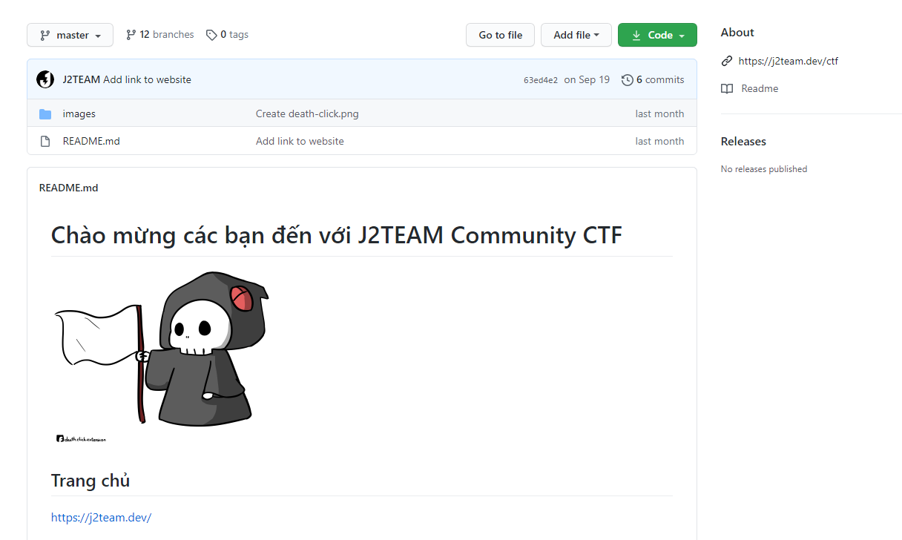

Trông chẳng thấy có gì mình sẽ kiểu tra đến phần history commit thì lòi ra:

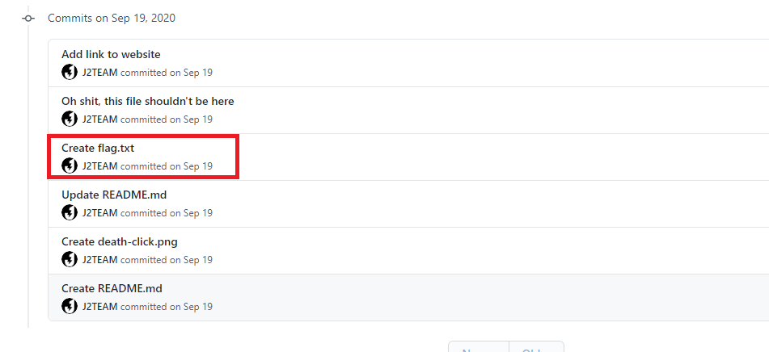

Đây chính là flag yeah.

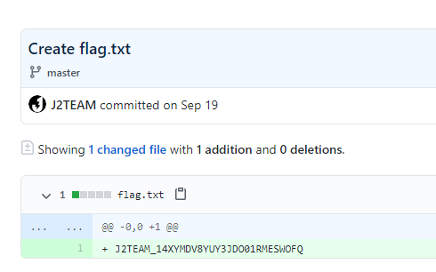

## Nhiệm vụ 26:

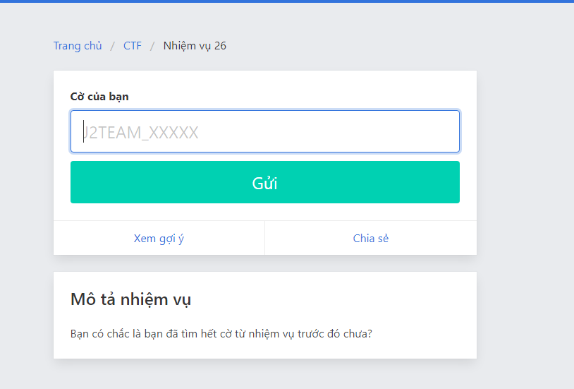

Really?? Repository github challenge trước vẫn còn flag ư🤔hmm, mình sẽ kiểm tra lại lần này sẽ kiểm tra đến phần branches của git.

Oh có tận 12 branches tìm cái patch cuối cùng này có thể chứa flag:

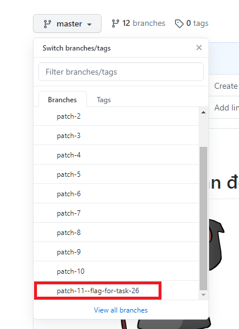

Đã xong đã tìm thấy flag :3

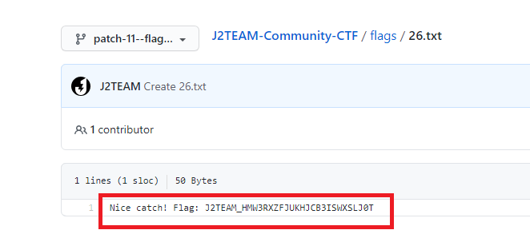

## Nhiệm vụ 27:

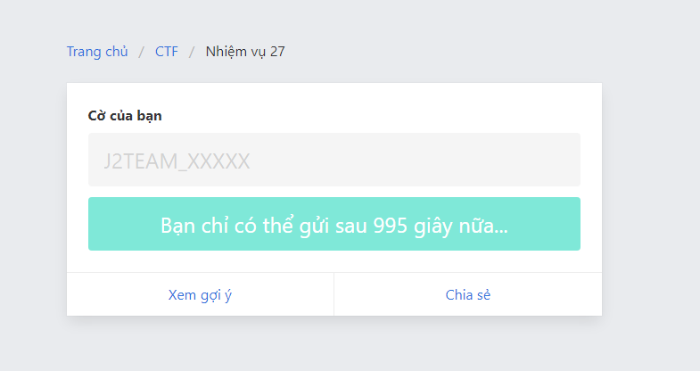

Ái chà câu này mà muốn submit chắc cx phải đợi lâu lắm đây :3 mình sẽ lươn lẹo để set lại thời gian nhé.

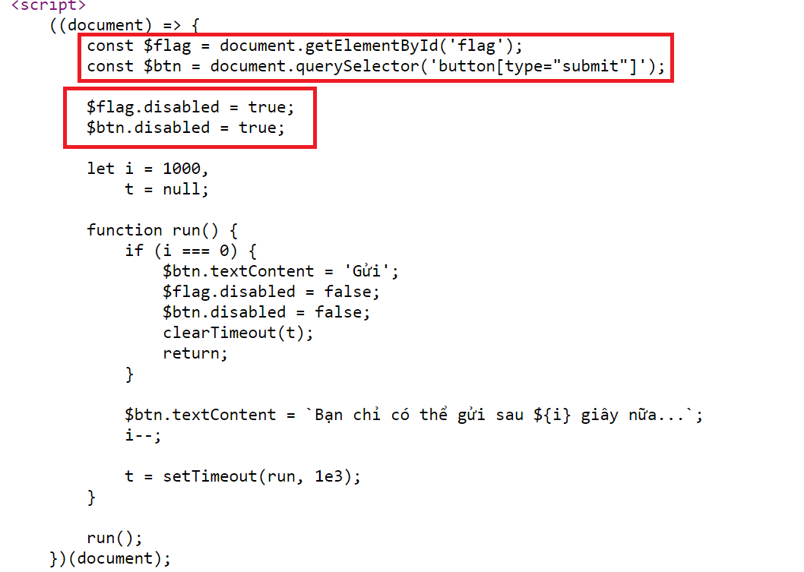

Không phải đây thực chất là 1 challenge đã được ẩn form submit đi, tìm flag trước đã thì khi mình kéo trang view-source thì flag nằm ở cuối trang.

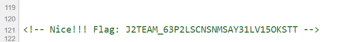

Mình sẽ submit câu này bằng code như sau:

```javascript
document.querySelector('[name="flag"]').value = document.querySelector('body').childNodes[9].data.trim().split('Flag: ')[1]
document.querySelector('form').submit()
```
Done :3

## Nhiệm vụ 29:
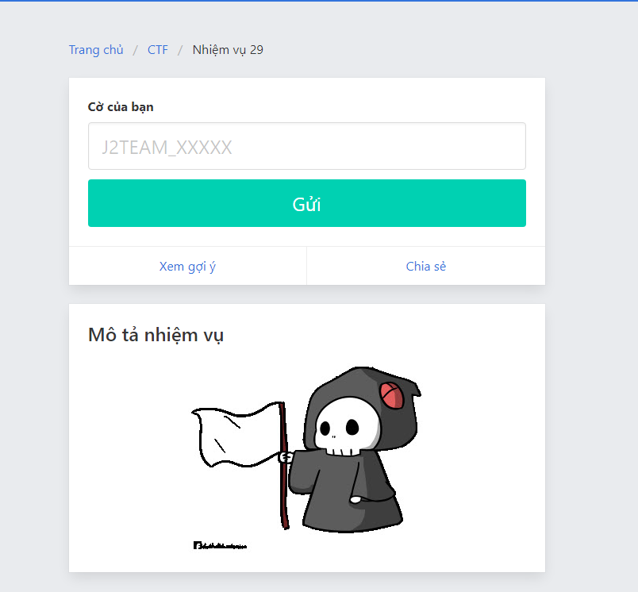

Câu này nhìn có vẻ khá quen thuộc :3

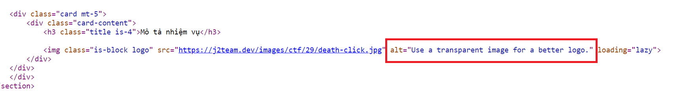

Oh, một câu gợi ý ư, mình sẽ thử cái đuôi khác cho cái ảnh xem sao

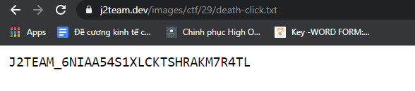

Ồ thì ra nó ở trong file txt.c

## Nhiệm vụ 30:


Lại một bài source code PHP nữa :3
Để ý ta sẽ thấy hàm `substr($input, 15)` sẽ lấy ra các kí tự đứng đằng sau kí tự thứ 15 của chuỗi `$input`, vì vậy muốn submit đúng t phải thêm 15 kí tự bất kì vào chuỗi flag.

Flag phần view-source đã có

Done :3

----
Cuộc thi dù vẫn còn dài, các challenge vẫn chưa được up hết nhưng vì điều khoản bên J2TEAM nên mình xin phép tạm dừng writeup ở đây. Hi vọng các bạn đều đã tìm được những kiến thức bổ ích cho mình <3 <3